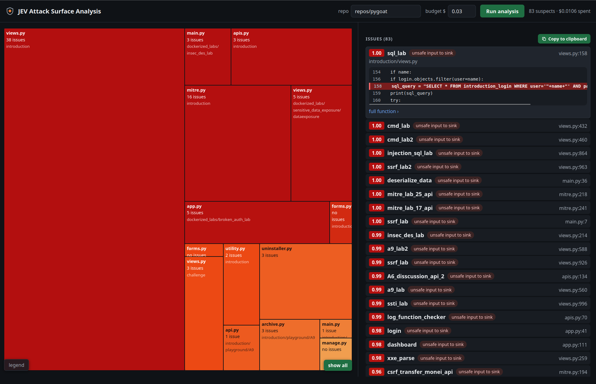

# JEV Attack Surface Analysis

Maps the attack surface of a backend codebase and flags likely vulnerabilities, down to the
suspicious line, for about one cent per repo.

**Try it without installing anything:** https://franciscocarloserra.github.io/jev-attack-surface-analysis/
(read-only results on PyGoat and NodeGoat).





## What it does

You give it a repo (Python, JavaScript or TypeScript) and a budget in dollars. You get:

- a **map** of the codebase, one block per file, colored by how suspicious it is;
- a **ranked list of potential vulnerabilities**, each pointing to the exact line
  (e.g. user input reaching SQL, `eval`, a shell or an outbound request);
- a **copy button** (or `print_issues.py`) that hands that list to an AI agent, with the
  instruction to *validate* each issue, not to fix it.

No LLM is involved. Plain Python reads the code; **jev**, a classifier that answers fixed
questions with probabilities in under a second and at about $42 per billion input tokens,
does all the judging.

## How it works

Like a magnifying glass: it looks at the whole repo coarsely, then zooms into the
suspicious parts only. At each level jev rates every item, and only the hot ones are opened
at the next level.

```
repo
 │
 ▼  1. directories   jev reads names only            → drops tests, docs, migrations
 │
 ▼  2. files         jev reads imports + signatures  → exposure: none / low / medium / high
 │
 ▼  3. functions     jev reads the code              → does external input reach a dangerous operation?
 │
 ▼  4. lines         jev picks one of the function's lines → where the vulnerability happens
 │
 ▼
ranked issues ──► viewer / copy ──► your agent validates them
```

- **Heat** (0 to 1): how suspicious an item is, computed from jev's probabilities.
- **Budget**: each level gets a share; what one level does not spend passes to the next.
  The hottest items go first, so if money runs out, what is left out is the least suspicious.

## Results so far

Tested only against two apps that are vulnerable on purpose (measured 2026-10-02):

| Repo | Language | Cost | Top issues found |
| --- | --- | --- | --- |
| [PyGoat](https://github.com/adeyosemanputra/pygoat) | Python / Django | $0.010 | SQL injection, `eval`, `pickle.loads`, SSRF |
| [NodeGoat](https://github.com/OWASP/NodeGoat) | JavaScript / Express | $0.007 | `eval` on request body, open redirect, SSRF, NoSQL `$where` injection |

## Run it

You need a TypeSafe API key for jev.

```bash
python3 -m venv .venv && .venv/bin/pip install -r requirements.txt
export TYPESAFE_API_KEY=...
git clone --depth 1 https://github.com/adeyosemanputra/pygoat repos/pygoat

python3 viewer_server.py        # open http://localhost:7801/heatmap_viewer.html
```

In the viewer pick the repo, set a budget (max $0.05 per run) and press **Run analysis**.
From the shell instead:

```bash
.venv/bin/python attack_surface_scan.py repos/pygoat --budget 0.03
python3 print_issues.py examples/pygoat/scan_result.json --top 10
```

Every run is saved in `examples/<repo>/runs/<run id>.json` (with date, scanner version and
settings hash) and the latest one in `examples/<repo>/scan_result.json`.
Agents: see `AGENTS.md` for the commands and the result format.

## Files

| File | What it is |
| --- | --- |
| `attack_surface_scan.py` | the scanner |
| `classification_levels.json` | every setting: questions to jev, categories, thresholds, budget shares, languages |
| `heatmap_viewer.html` + `viewer_server.py` | the viewer, and the small server that lets it start runs |
| `print_issues.py` | issue list as text, for agents |
| `examples/` | saved runs |

## Adapt it

- **Ask different questions** or change thresholds: edit `classification_levels.json`.
- **Add a language**: add an entry to `languages` in the same file (file extensions and
  the parser's names for imports, functions and classes).
- **Add a level** (e.g. HTTP routes): write one `extract_<unit>` function in
  `attack_surface_scan.py`, register it in `UNIT_EXTRACTORS` and add the level to the JSON.

## Limits

- It ranks candidates for review; it does not prove a vulnerability exists.
- Each function is judged on its own, so a flaw spread across several functions can be missed.
